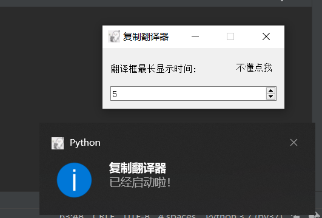
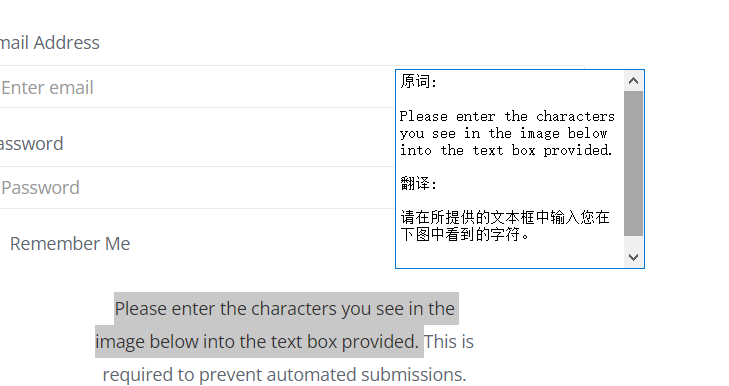
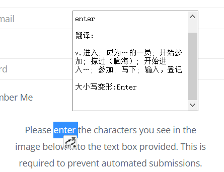

# CopyTranslator

复制翻译器

用鼠标右键或者快捷键复制文本，会在鼠标周围产生悬浮框，框中出现翻译的内容，仅支持英->中

复制文本即可实现中英文翻译

采用pyqt5制作，获取粘贴板的内容，post数据

使用beautifulsoup解析金山词霸网页内容然后提取获得

若失效请打开金山词霸网页使用F12找到指定元素，修改translator.py的34 40 53行

---
Copy translator

Copying text with the right mouse button or shortcut key will generate a floating box around the mouse, and the translated content will appear in the box. It only supports English - > Chinese

Copy the text to achieve Chinese English translation

Made with pyqt5, get the contents of the pasteboard and post data

The content of Kingsoft Ciba web page is parsed by using beatifulsoup, and then extracted

If it fails, please open Kingsoft Ciba web page, use F12 to find the specified element, and modify line 34, 40 and 53 of translator.py
---

